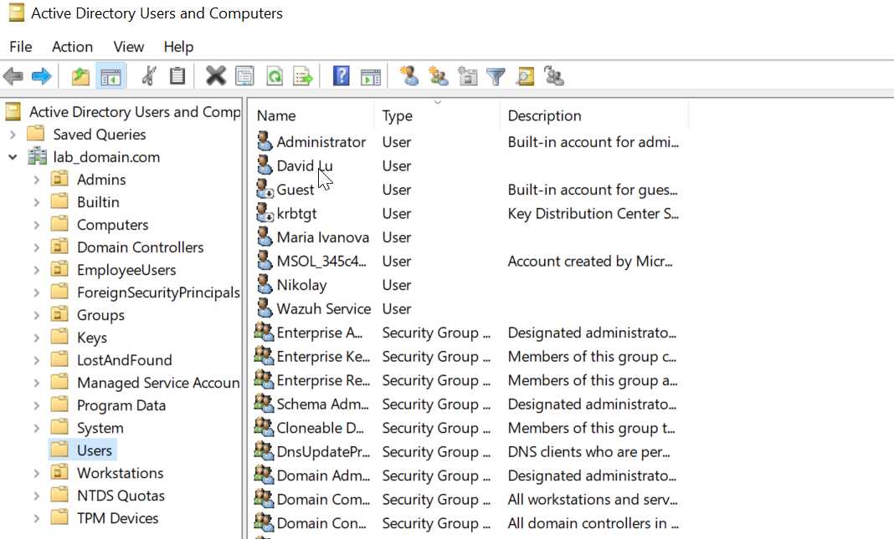

\# Active Directory

\## Overview

Microsoft Active Directory Domain Services (AD DS) provides the centralized identity and access management platform for the Enterprise Zero Trust Architecture.

It serves as the authoritative identity source for users, computers, and security groups while enabling secure authentication and authorization across the enterprise environment.

Within this architecture, Active Directory integrates with Microsoft Entra ID to support a hybrid identity model and secure access to internal applications through Zscaler Private Access (ZPA).

\# Purpose

Active Directory provides the following core services:

\- Centralized user management

\- Computer management

\- Authentication services

\- Authorization services

\- Security group management

\- Group Policy management

\- Integration with cloud identity services

These capabilities establish the identity foundation required for implementing Zero Trust principles.

\---

\# Domain Architecture

The environment consists of a single Active Directory domain designed for centralized administration and identity management.

The domain provides:

\- User authentication

\- Computer authentication

\- Security group administration

\- Organizational Unit (OU) management

\- Kerberos authentication

\- LDAP directory services

\---

\# Authentication Process

Authentication follows the standard Active Directory workflow:

1\. User signs in to a domain-joined workstation.

2\. Credentials are validated by the Domain Controller.

3\. Kerberos issues a Ticket Granting Ticket (TGT).

4\. Service tickets are issued when users access enterprise resources.

5\. Security policies are enforced through Group Policy.

6\. Identity information is synchronized with Microsoft Entra ID where required.

This process ensures centralized identity validation before access is granted.

\---

\# Organizational Units

The environment uses Organizational Units (OUs) to simplify administration and policy management.

Typical examples include:

\- Users

\- Workstations

\- Servers

\- Service Accounts

\- Administrative Accounts

This logical separation allows Group Policies and administrative permissions to be applied consistently.

\---

\# Security Groups

Security groups are used to assign permissions based on job roles rather than individual user accounts.

Examples include:

\- Domain Administrators

\- Server Administrators

\- Help Desk

\- Standard Users

\- Application Administrators

Using groups simplifies permission management and supports the principle of least privilege.

\---

\# Group Policy

Group Policy Objects (GPOs) are used to enforce security settings across the domain.

Typical policies include:

\- Password Policy

\- Account Lockout Policy

\- Windows Firewall Configuration

\- Security Auditing

\- Windows Update Configuration

\- Administrative Restrictions

Group Policy provides centralized and consistent security configuration.

\---

\# Hybrid Identity Integration

Active Directory integrates with Microsoft Entra ID to provide a hybrid identity solution.

This integration enables:

\- Cloud authentication

\- Single Sign-On (SSO)

\- Modern identity services

\- Identity synchronization

\- Secure access to cloud-based security platforms

Hybrid identity allows users to authenticate consistently across on-premises and cloud environments.

\---

\# Security Considerations

The Active Directory environment follows several security best practices:

\- Least privilege administration

\- Dedicated administrative accounts

\- Strong password policies

\- Account lockout protection

\- Security auditing

\- Regular backups

\- Controlled administrative access

Administrative privileges should only be assigned when required.

\---

\# Validation

The deployment is considered successful when:

\- Domain Controller services are operational.

\- Users can authenticate successfully.

\- Computers can join the domain.

\- DNS functions correctly.

\- Group Policy is applied successfully.

\- Identity synchronization with Microsoft Entra ID operates correctly.

\- Security events are collected by Wazuh.

\---

\# Best Practices

Recommended practices include:

\- Minimize Domain Administrator usage.

\- Use security groups for permissions.

\- Separate administrative and standard user accounts.

\- Monitor authentication events.

\- Apply security updates regularly.

\- Document all configuration changes.

\---

\# Related Documentation

\- Windows Server

\- Microsoft Entra ID

\- ZPA Deployment

\- Wazuh SIEM

\- Terraform Infrastructure as Code

