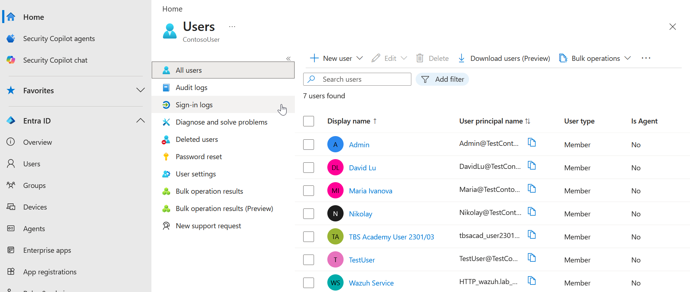

\# Microsoft Entra ID

Microsoft Entra ID serves as the cloud identity provider within the Enterprise Zero Trust Architecture.

It extends the on-premises Active Directory environment by providing cloud-based authentication, identity management, and secure access to enterprise applications. Through integration with Zscaler Private Access (ZPA), Microsoft Entra ID enables users to authenticate before access is granted to internal resources.

\---

\# Purpose

Microsoft Entra ID provides the following capabilities:

\- Cloud identity management

\- User authentication

\- Single Sign-On (SSO)

\- Hybrid identity integration

\- Application authentication

\- Identity federation

\- Secure access to enterprise resources

These capabilities strengthen identity verification while supporting modern Zero Trust principles.

\---

\# Role Within the Architecture

Microsoft Entra ID acts as the cloud identity provider for the environment.

It works together with:

\- Active Directory

\- Zscaler Private Access

\- Enterprise applications

\- Administrative users

Instead of relying solely on on-premises authentication, users are validated through Microsoft Entra ID before application access is granted.

\---

\# Hybrid Identity

The architecture combines:

\- On-premises Active Directory

\- Microsoft Entra ID

This hybrid identity model provides:

\- Centralized identity management

\- Cloud authentication

\- Single Sign-On

\- Consistent user identities

\- Secure authentication for cloud services

Users maintain a single identity across both environments.

\---

\# Authentication Flow

The authentication process follows these steps:

1\. User opens a protected application.

2\. ZPA redirects authentication to Microsoft Entra ID.

3\. User authenticates successfully.

4\. Microsoft Entra ID returns an authentication token.

5\. ZPA evaluates access policies.

6\. The App Connector establishes the secure application connection.

7\. The user gains access only to the authorized application.

The internal network itself is never exposed.

\---

\# Integration with Active Directory

Microsoft Entra ID integrates with Active Directory to provide:

\- Hybrid identities

\- Centralized account management

\- Consistent authentication

\- Cloud application access

This allows enterprise users to use a single identity across both on-premises and cloud services.

\---

\# Security Considerations

The environment follows several identity security best practices:

\- Identity-first authentication

\- Least privilege access

\- Secure application authentication

\- Centralized identity management

\- Modern authentication protocols

\- Continuous identity validation

Where available, organizations should also implement:

\- Multi-Factor Authentication (MFA)

\- Conditional Access policies

\- Risk-based authentication

\- Identity Protection

\---

\# Benefits

Using Microsoft Entra ID provides several advantages:

\- Centralized cloud identity

\- Simplified authentication

\- Reduced credential management

\- Better user experience

\- Stronger identity security

\- Improved scalability

\---

\# Validation

The integration is considered successful when:

\- Users can authenticate through Microsoft Entra ID.

\- Enterprise applications trust Microsoft Entra ID.

\- ZPA successfully redirects authentication.

\- Authorized users receive application access.

\- Unauthorized users are denied access.

\- Authentication events are visible within monitoring systems.

\---

\# Best Practices

Recommended practices include:

\- Enable Multi-Factor Authentication.

\- Use the principle of least privilege.

\- Monitor sign-in activity.

\- Review administrative roles regularly.

\- Protect privileged accounts.

\- Document identity configuration changes.

\---

\# Related Documentation

\- Active Directory

\- ZPA Deployment

\- Wazuh SIEM

\- Solution Architecture

