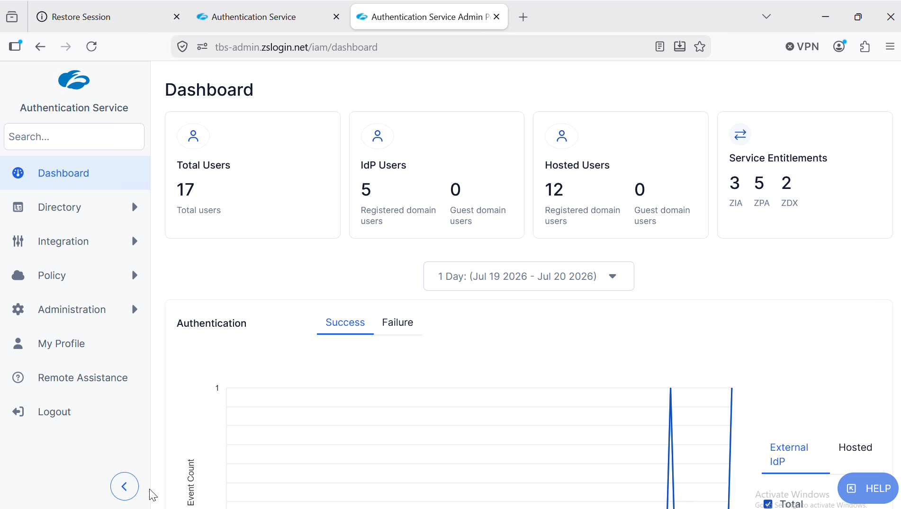
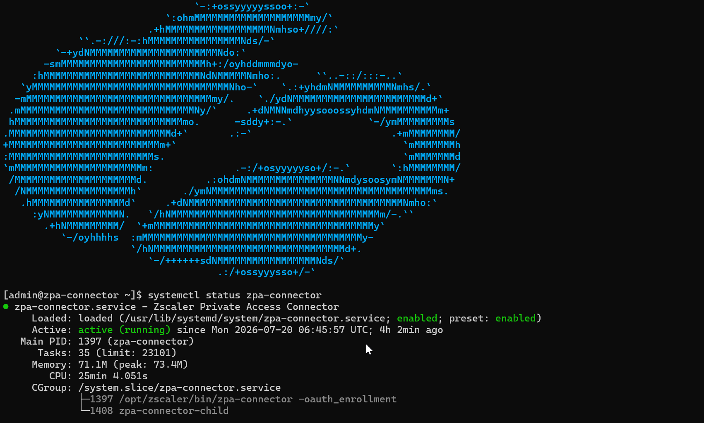
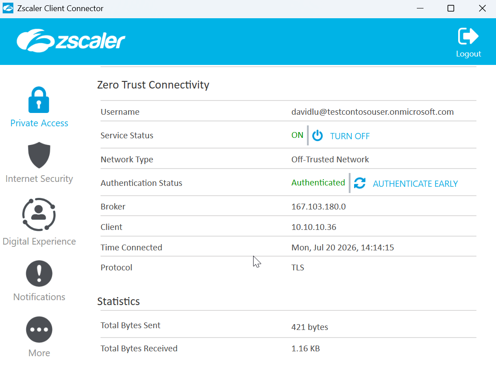

\# Zscaler Private Access (ZPA)


\## Overview



Zscaler Private Access (ZPA) provides the Zero Trust Network Access (ZTNA) solution within the Enterprise Zero Trust Architecture.


Instead of granting users network-level access through a traditional VPN, ZPA establishes secure, application-specific connections based on user identity, device posture, and access policies.


Applications remain private and are never directly exposed to the Internet.


\---


\# Purpose


The primary objectives of the ZPA deployment are:


\- Eliminate traditional VPN access

\- Protect internal applications

\- Reduce the attack surface

\- Enforce identity-based access

\- Prevent unauthorized lateral movement

\- Secure remote access

\- Support Zero Trust Architecture


\---


\# Architecture


The deployment consists of the following components:


| Component | Purpose |

|------------|---------|

| ZPA Cloud | Policy enforcement and broker |

| App Connector | Secure outbound connection to ZPA Cloud |

| Client Connector | User endpoint connectivity |

| Microsoft Entra ID | Identity Provider (IdP) |

| Application Segments | Protected applications |

| Server Groups | Backend servers |

| Segment Groups | Logical application grouping |


\---


\# Deployment Architecture


The environment follows this logical flow:


```text

User Device

&#x20;     │

&#x20;     ▼

Client Connector

&#x20;     │

&#x20;     ▼

Microsoft Entra ID

&#x20;     │

&#x20;     ▼

ZPA Cloud

&#x20;     │

&#x20;     ▼

App Connector

&#x20;     │

&#x20;     ▼

Internal Application

```


All communication is initiated outbound from the App Connector to the ZPA Cloud.


No inbound firewall rules are required.


\---


\# ZPA Components


\## ZPA Tenant


The ZPA tenant provides:


\- Centralized administration

\- Policy management

\- Identity integration

\- Application publishing

\- Logging and reporting


\---


\## App Connector



The App Connector is deployed within the internal network.


Responsibilities include:


\- Maintaining outbound TLS connections

\- Connecting users to private applications

\- Preventing direct Internet exposure

\- Forwarding authorized traffic


The App Connector never accepts inbound Internet connections.


\---


\## Client Connector



The Client Connector is installed on endpoint devices.


It provides:


\- User authentication

\- Secure tunnel establishment

\- Policy enforcement

\- Application connectivity


Users authenticate before any application session is established.


\---


\## Application Segments


Application Segments define which internal applications are published through ZPA.


Each segment specifies:


\- FQDN

\- IP Address

\- Port

\- Protocol


Only explicitly defined applications are accessible.


\---


\## Segment Groups


Segment Groups organize multiple Application Segments into logical collections.


Benefits include:


\- Easier administration

\- Policy simplification

\- Scalability


\---


\## Server Groups


Server Groups define which App Connectors provide access to protected applications.


They enable:


\- Load distribution

\- Logical grouping

\- Future scalability


\---


\# Authentication


Authentication is performed through Microsoft Entra ID.


The process is:


1\. User launches Client Connector.

2\. User authenticates using Microsoft Entra ID.

3\. ZPA validates the identity.

4\. Access Policy is evaluated.

5\. App Connector establishes the secure connection.

6\. User gains access only to authorized applications.


\---


\# Access Policies


Access decisions are based on:


\- User identity

\- User groups

\- Application

\- Authentication status


The architecture follows the Principle of Least Privilege.


Users receive access only to the applications required for their role.


\---


\# Traffic Flow


The secure application flow is:


```text

Internet


↓


ZPA Cloud


↓


App Connector


↓


Internal Application

```


The internal application is never directly reachable from the Internet.


\---


\# Terraform Automation


Terraform is used to automate the deployment of supported ZPA resources.


Current Infrastructure as Code includes:


\- Application Segments

\- Segment Groups

\- Server Groups


Automation improves:


\- Repeatability

\- Version control

\- Change management

\- Consistency


\---


\# Security Benefits


The deployment provides:


\- Zero Trust access

\- Identity-based authentication

\- No exposed internal services

\- Reduced attack surface

\- Least privilege access

\- Centralized policy management


\---


\# Validation


Deployment is considered successful when:


\- App Connector is connected.

\- Client Connector authenticates successfully.

\- Microsoft Entra ID authentication succeeds.

\- Applications are accessible only to authorized users.

\- Unauthorized access is denied.

\- Internal applications remain inaccessible from the public Internet.


\---


\# Best Practices


Recommended practices include:


\- Deploy multiple App Connectors for high availability.

\- Use Multi-Factor Authentication (MFA).

\- Apply least privilege policies.

\- Review access policies regularly.

\- Monitor authentication logs.

\- Automate configuration where possible.


\---


\# Related Documentation


\- Microsoft Entra ID

\- Active Directory

\- Terraform Infrastructure as Code

\- Wazuh SIEM

