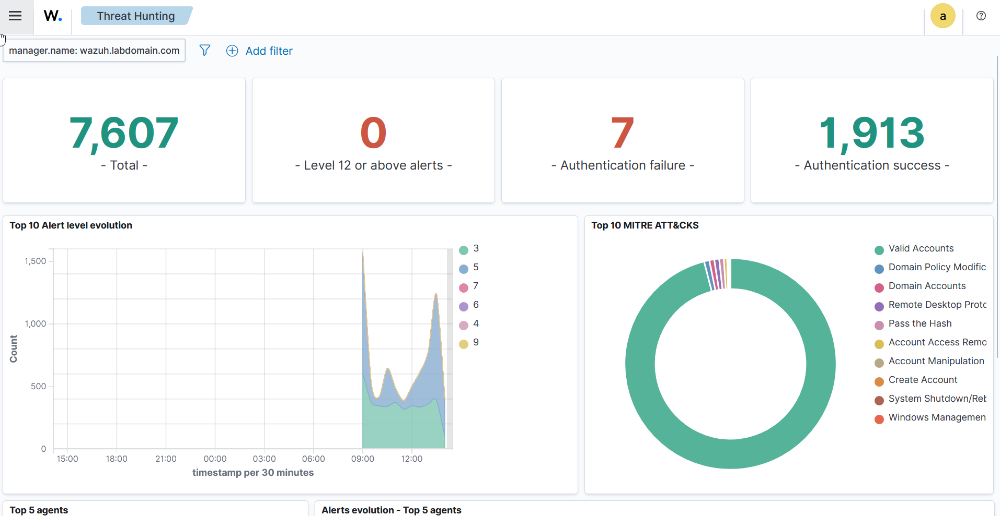
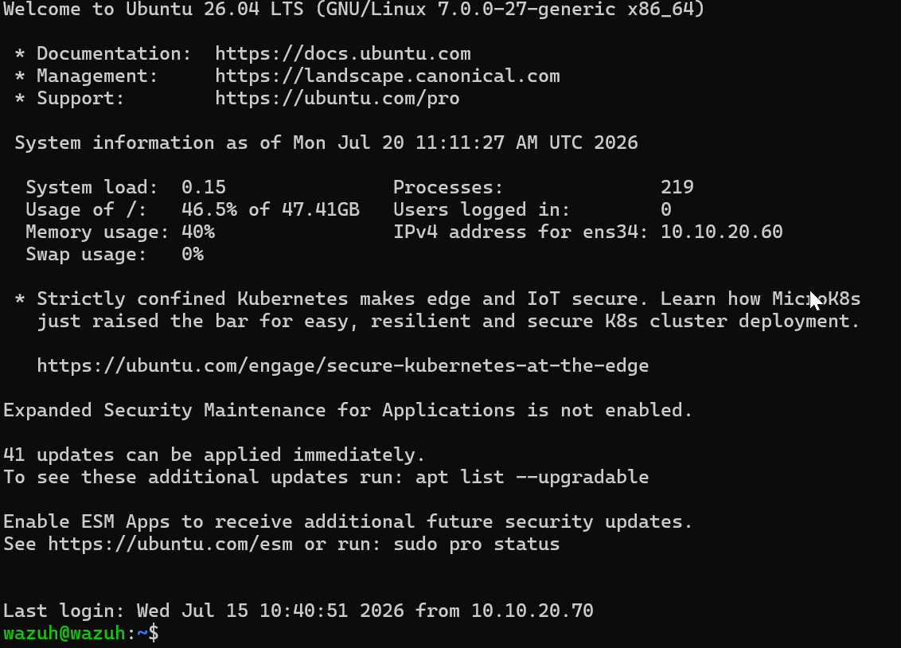

\# Wazuh Security Information and Event Management (SIEM)

\## Overview

Wazuh provides the centralized Security Information and Event Management (SIEM) platform within the Enterprise Zero Trust Architecture.

 

It collects, analyzes, and correlates security events from enterprise systems, enabling administrators to detect suspicious activity, monitor system health, and investigate potential security incidents.

By centralizing logs from Windows and Linux systems, Wazuh improves visibility across the entire infrastructure and supports the Zero Trust principle of continuous monitoring.

\---

\# Purpose

The Wazuh deployment provides the following capabilities:

\- Centralized log collection

\- Security event monitoring

\- Threat detection

\- File Integrity Monitoring (FIM)

\- Vulnerability detection

\- Compliance monitoring

\- Security alerting

\- Incident investigation

\---

\# Architecture

The Wazuh deployment consists of the following components:

| Component | Purpose |

|------------|---------|

| Wazuh Server | Collects and analyzes security events |

| Wazuh Dashboard | Web interface for monitoring and investigations |

| Wazuh Agents | Installed on monitored systems |

| Elasticsearch / OpenSearch | Stores indexed security data |

\---

\# Monitored Systems

The following systems are monitored:

| System | Purpose |

|---------|---------|

| Windows Server | Authentication and Active Directory events |

| IIS Server | Web application events |

| Ubuntu Server | System logs |

| ZPA App Connector | Operating system monitoring (where applicable) |

As the environment grows, additional systems can be onboarded.

\---

\# Data Collection

Wazuh collects security telemetry including:

\- Windows Event Logs

\- Linux Syslog

\- Authentication events

\- Security events

\- File Integrity Monitoring

\- Process activity

\- System inventory

\- Vulnerability information

Centralized collection simplifies security investigations and auditing.

\---

\# Detection Capabilities

Wazuh provides detection for events such as:

\- Failed logon attempts

\- Privilege escalation

\- Unauthorized file modifications

\- Malware indicators

\- Service failures

\- Configuration changes

\- Brute-force activity

\- System anomalies

Alerts are categorized by severity to help prioritize incident response.

\---

\# File Integrity Monitoring (FIM)

File Integrity Monitoring tracks changes to critical files and directories.

This helps detect:

\- Unauthorized modifications

\- Deleted files

\- New files

\- Configuration changes

\- Potential compromise

FIM supports early detection of suspicious activity.

\---

\# Vulnerability Detection

Wazuh can identify known vulnerabilities affecting monitored systems.

This capability assists with:

\- Risk assessment

\- Patch prioritization

\- Compliance reporting

\- Security posture improvement

\---

\# Security Considerations

The Wazuh deployment follows these best practices:

\- Secure administrative access

\- Regular updates

\- Principle of least privilege

\- Agent authentication

\- Centralized log retention

\- Protected dashboard access

Security monitoring itself should also be monitored and maintained.

\---

\# Validation

The deployment is considered successful when:

\- Wazuh Server is operational.

\- Agents report successfully.

\- Security events appear in the dashboard.

\- Alerts are generated for test events.

\- File Integrity Monitoring detects changes.

\- Authentication events are collected.

\---

\# Best Practices

Recommended practices include:

\- Review alerts regularly.

\- Keep detection rules updated.

\- Monitor agent health.

\- Protect administrative accounts.

\- Tune alert rules to reduce false positives.

\- Backup configuration regularly.

\---

\# Integration with the Architecture

Wazuh complements the Enterprise Zero Trust Architecture by providing visibility into identity, infrastructure, and application activity.

Examples include:

\- Monitoring Active Directory authentication

\- Collecting Windows Server logs

\- Monitoring Linux servers

\- Detecting configuration changes

\- Supporting security investigations

This continuous monitoring aligns with the Zero Trust principle of verifying and observing all activity.

\---

\# Related Documentation

\- Active Directory

\- Microsoft Entra ID

\- ZPA Deployment

\- Network Design

\- Terraform Infrastructure as Code

