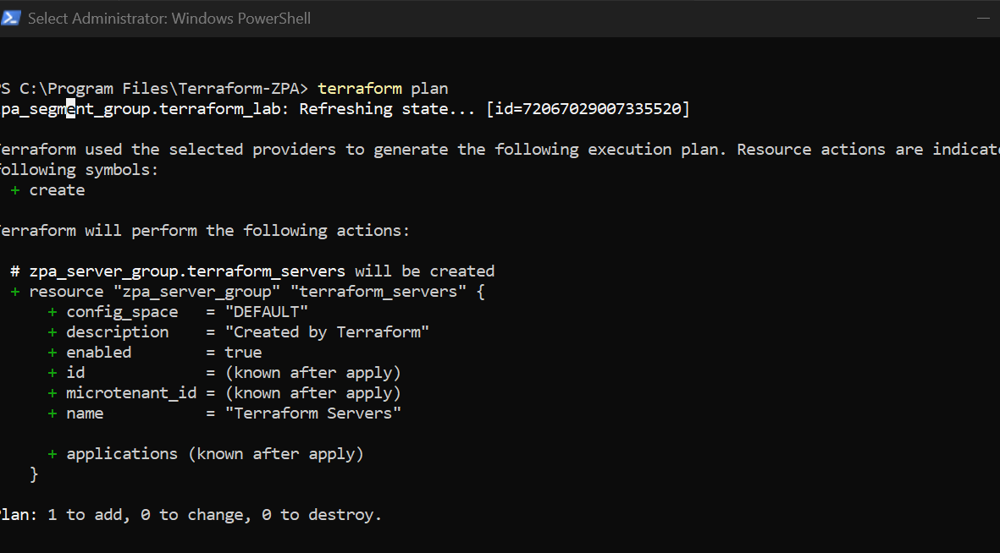

\# Terraform Infrastructure as Code (IaC)


\## Overview


Terraform is used to automate the deployment and management of supported Zscaler Private Access (ZPA) resources within the Enterprise Zero Trust Architecture.



Instead of manually configuring resources through the ZPA administration portal, Infrastructure as Code (IaC) enables repeatable, version-controlled, and consistent deployments.


The Terraform configuration in this repository demonstrates how automation can simplify the management of enterprise Zero Trust environments.


\---


\# Purpose


Terraform is used to:


\- Automate ZPA resource deployment

\- Standardize infrastructure configuration

\- Reduce manual configuration errors

\- Enable version control

\- Simplify change management

\- Improve deployment consistency


Infrastructure as Code ensures that the environment can be recreated in a predictable manner.


\---


\# Architecture


Terraform interacts directly with the Zscaler ZPA API through the official provider.


```text

Terraform Configuration


&#x20;       │


&#x20;       ▼


Terraform Provider


&#x20;       │


&#x20;       ▼


ZPA API


&#x20;       │


&#x20;       ▼


ZPA Tenant


&#x20;       │


&#x20;       ▼


Application Segments

Server Groups

Segment Groups

```


\---


\# Repository Structure


&#x20;

Infrastructure/

└── terraform/

&#x20;   ├── main.tf

&#x20;   ├── provider.tf

&#x20;   ├── variables.tf

&#x20;   ├── segment\_group.tf

&#x20;   ├── server\_group.tf

&#x20;   ├── terraform.tfvars.example

&#x20;   └── .terraform.lock.hcl

```


Each file has a specific responsibility to improve readability and maintainability.


\---


\# Configuration Files


\## provider.tf


Defines the Terraform provider and establishes authentication with the ZPA API.


\---


\## variables.tf


Contains reusable variables used throughout the configuration.


Examples include:


\- Customer ID

\- Client ID

\- Client Secret

\- Application names

\- Server definitions


Sensitive values are \*\*not\*\* stored directly in the configuration files.


\---


\## main.tf


Contains the primary Terraform resources and shared configuration.


\---


\## segment\_group.tf


Creates and manages ZPA Segment Groups.


\---


\## server\_group.tf


Creates and manages ZPA Server Groups.


\---


\## terraform.tfvars.example


Provides an example configuration file.


Users should copy this file to:


terraform.tfvars

```


and populate it with their own environment-specific values.


The actual `terraform.tfvars` file is excluded from version control because it contains sensitive information.


\---


\# Managed Resources


The current deployment automates:


\- Application Segments

\- Segment Groups

\- Server Groups


The configuration can be expanded to manage additional supported ZPA resources as the environment evolves.


\---


\# Deployment Workflow


Typical deployment process:


1\. Configure provider credentials.

2\. Review variables.

3\. Initialize Terraform.

4\. Validate the configuration.

5\. Generate an execution plan.

6\. Apply the deployment.

7\. Verify resources within the ZPA Admin Portal.


\---


\# Security Considerations


The following files should \*\*never\*\* be committed to version control:


\- terraform.tfvars

\- terraform.tfstate

\- terraform.tfstate.backup

\- terraform-debug.log

\- .terraform/


Sensitive credentials such as Client Secrets and API tokens must remain outside the repository.


Use `.gitignore` to exclude all generated and sensitive files.


\---


\# Validation


Deployment is considered successful when:


\- Terraform initializes successfully.

\- The configuration validates without errors.

\- The execution plan matches the intended changes.

\- Resources are created within ZPA.

\- No unexpected changes appear during subsequent plan operations.


\---


\# Best Practices


Recommended practices include:


\- Separate configuration into multiple files.

\- Use variables instead of hardcoded values.

\- Store secrets securely.

\- Validate changes before applying.

\- Review execution plans carefully.

\- Commit infrastructure changes through version control.

\- Document all modifications.


\---


\# Benefits


Using Terraform provides:


\- Repeatable deployments

\- Version-controlled infrastructure

\- Reduced manual effort

\- Improved consistency

\- Easier collaboration

\- Simplified change management


\---


\# Related Documentation


\- ZPA Deployment

\- Microsoft Entra ID

\- Solution Architecture

\- GitHub Repository Structure

