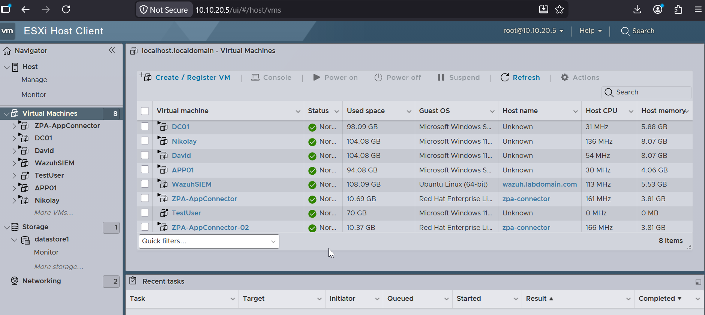

\# VMware ESXi

\## Overview

VMware ESXi provides the virtualization platform for the Enterprise Zero Trust Architecture.

It hosts all enterprise workloads, including identity services, application servers, monitoring infrastructure, and Zero Trust components.

The hypervisor enables efficient resource utilization while providing logical isolation between virtual machines.

\# Purpose

The ESXi host provides:

\- Enterprise virtualization

\- Resource allocation

\- Virtual networking

\- High flexibility for testing and deployment

\- Centralized infrastructure management

The virtualization layer allows multiple enterprise services to operate on a single physical server while remaining logically separated.

\---

\# Virtual Machines

The current environment contains the following virtual machines:

| Virtual Machine | Purpose |

|-----------------|---------|

| Domain Controller | Active Directory \& DNS |

| IIS Server | Internal web application |

| Wazuh Server | SIEM and centralized monitoring |

| ZPA App Connector | Secure application access |

Additional virtual machines can be deployed as the architecture evolves.

\---

\# Virtual Networking

The ESXi host connects to the enterprise network through the Cisco Catalyst 2960 switch.

Network connectivity is provided using virtual switches and port groups that connect virtual machines to the appropriate VLANs.

Current design includes:

\- User Network (VLAN 10)

\- Management / Server Network (VLAN 20)

This separation limits unnecessary communication between clients and infrastructure services.

\---

\# Resource Allocation

The ESXi host allocates CPU, memory, storage, and networking resources to each virtual machine.

Resources should be sized according to workload requirements while maintaining sufficient capacity for future expansion.

Example considerations include:

\- vCPU allocation

\- Memory reservation

\- Storage capacity

\- Network bandwidth

\---

\# Security Considerations

The virtualization platform follows several security best practices:

\- Dedicated management network

\- Strong administrative credentials

\- Least privilege administration

\- Regular snapshot management

\- Restricted management access

\- Secure virtual networking

Administrative interfaces should never be directly exposed to the Internet.

\---

\# Validation

Successful deployment can be verified by confirming:

\- ESXi host is operational.

\- Virtual machines are powered on.

\- Network connectivity is available.

\- Active Directory is reachable.

\- IIS application is accessible internally.

\- Wazuh receives log data.

\- ZPA App Connector maintains connectivity to the Zscaler cloud.

\---

\# Best Practices

Recommended practices include:

\- Keep ESXi updated.

\- Minimize the number of administrative accounts.

\- Monitor host resource utilization.

\- Maintain regular backups.

\- Document all infrastructure changes.

\---

\# Related Documentation

\- Network Design

\- Windows Server

\- Active Directory

\- Wazuh SIEM

\- ZPA Deployment

